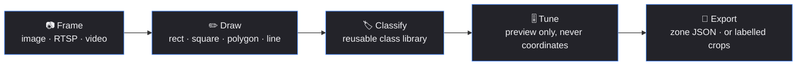

<div align="center">

# 🎯 Camera Calibration & Image Studio

**Draw the zones. Get the JSON. Ship the pipeline.**

A Windows desktop tool for turning camera frames into production-ready ROI/zone
calibration and labelled training data — pixel-exact coordinates, live JSON, and
frames pulled straight from your cameras.

[](https://github.com/ChakraDeep8/CameraCalibrationStudio/releases/latest)
[](https://github.com/ChakraDeep8/CameraCalibrationStudio/releases)
[](#-requirements)
[](https://dotnet.microsoft.com/)
[](https://github.com/shimat/opencvsharp)

[**⬇️ Download**](https://github.com/ChakraDeep8/CameraCalibrationStudio/releases/latest) ·
[**What's New**](#-whats-new-in-v130) ·
[**Quick Start**](#-quick-start) ·
[**Gestures**](#-canvas-gestures)

</div>

---

## ✨ What's New in v1.3.0

> Frames in, labelled dataset out — plus the click that finally always registers.

### 🗂️ Data Builder — a whole new workspace

Draw a box around each subject in a frame, label it (Staff, Customer, Security…), press
**Add Data**. Every region is cropped out of the **original full-resolution frame** and written
into a folder named after its label:

```
<output>/Staff/frame_01_143502.jpg
<output>/Customer/frame_02_143502.jpg
```

Regions stay on screen after Add Data with a ✓ against the ones already written, so a second
click can't duplicate them. **Save Database** closes the batch and appends a `labels.csv`
tying every crop back to its source frame and exact pixel rectangle — so a mislabelled crop
is always traceable.

It shares the class library with ROI Calibration, and deliberately has **no** adjustment or
filter controls: a training set wants the frame as the camera saw it.

### 🔗 One click from Image Editor to ROI Calibration

Clean a frame up in the editor, hit **Use in ROI Calibration**, and it opens there ready to
draw on — adjustments and filter baked into the pixels, full resolution, no save-and-reopen.

### 🐛 Clicks over an existing region no longer vanish

Placing polygon points on top of an existing line or ROI often did nothing. The shape overlay
is rebuilt on every mouse-move while drawing, so a mouse-down could be routed to an element
that had just been detached from the tree and never reach the canvas. Measured: **6 of 6**
clicks now register where previously the polygon wasn't created at all.

### ✂️ Also

- **Ctrl+D** duplicates the selected region · **right-click** grabs the palm
- Brightness/contrast and the filter now update the JSON panel **live**, like regions do
- **Lens Calibration has been removed** — the app is ROI Calibration, Image Editor and Data Builder

---

<details>
<summary><b>Previously, in v1.2.0</b></summary>

> The release that stopped making you hunt for a good frame — and stopped the canvas eating your image.

### 🎬 Grab Frame from Video — with an automatic blur check

Point it at a video file or stream and it finds a frame worth calibrating on. No scrubbing,
no guessing.

- **Sharpness scoring** via Laplacian variance — a Laplacian isolates edge detail, so a crisp
  frame produces a wide spread of responses and a blurred or motion-smeared one produces a
  narrow one.
- **Candidates are decoded concurrently, not one at a time.** Several workers each open their
  own capture and seek to positions spread across the video; the first frame over the threshold
  cancels the rest. Typically back in about a second.
- **It refuses to hand you a soft frame.** If nothing clears the bar, you're told how many were
  checked and what the best score was — instead of silently calibrating on mush.

```
sharp frame   ████████████████████████  577
blurred copy  ▌                           7.9      threshold ─── 100
```

### 🎨 Floating draw toolbar

The draw tools left the sidebar and now float over the canvas, OneNote-style — icon-only with
tooltips, accent highlight on the active tool, and **draggable** by its grip. The canvas gets
the space back.

### 🏷️ Class assignment in one box and one tick

No more custom-name detour or create-class sub-form. Type the name, decide whether it's
reusable:

| | |
|---|---|
| ☑ **Add as new class** | saved to the class library for every future calibration |
| ☐ **Leave unticked** | names this one region only, library untouched |

### 🔎 The JSON follows you

Select a zone and the Calibration JSON panel **scrolls to that zone's block and highlights it**
— with the numbers ticking over live while you drag its points.

### 📐 Reshape without redrawing

With a polygon selected, **double-click its outline** to insert a vertex right there, then drag
it like any other handle.

### 🐛 Fixed

- **The canvas cropped the bottom of every image.** The content grid was sized to the image's
  full pixel dimensions inside a shorter container, so WPF applied a *layout clip* before the
  zoom transform ever ran — no zoom level could recover the lost rows. Now hosted in a `Canvas`,
  which never layout-clips.
- **Clicking a region grabbed and dragged it.** A click now only selects; `Ctrl`+drag moves.
  Both edit paths capture the mouse, so a region can't get stuck to your cursor any more.
- **The objects list shoved the sidebar off-screen.** It has its own fixed-height scroll panel
  with a sticky filter header.
- Draw/Class panel decluttered — class chips and the always-on instruction caption are gone.

</details>

---

## 🗺️ The workflow



---

## 🧰 Workspaces

<table>
<tr>
<td width="33%" valign="top">

### 🎯 ROI Calibration
*The main event*

Draw regions, assign classes, watch the JSON build itself. Non-destructive
brightness/contrast/sharpness, colour calibration, a 17-filter gallery, object list with
visibility/rename/duplicate/delete, undo/redo, zoom/pan, and a `Batch…` dialog to apply the
current adjustments across a folder.

</td>
<td width="33%" valign="top">

### 🖼️ Image Editor
*Fix the frame first*

Rotate, flip, crop, resize. Real-time non-destructive brightness/contrast/sharpness plus a
one-at-a-time filter gallery. **Use in ROI Calibration** sends the cleaned-up frame straight
across — no save-and-reopen.

</td>
<td width="33%" valign="top">

### 🗂️ Data Builder
*Turn frames into a training set*

Draw a box around each subject, label it, press **Add Data** — every region is written out as
its own image into a folder named after its label. **Save Database** closes the batch with a
`labels.csv` index.

</td>
</tr>
</table>

---

## 📌 Coordinate accuracy — the non-negotiable

> ROI geometry is stored and exported in the **original image's pixel resolution**, always.

Zoom, pan, brightness, colour, filters — none of it touches the numbers. All geometry lives in
image-pixel space and a single transform maps it to the screen, so WPF's own transform-aware hit
testing hands back image coordinates directly. **Screen coordinates never leak into your JSON.**

---

## 📤 Two exports

| Export | What it is |
|---|---|
| **Save Calibration** | The app's native schema — image metadata, adjustment values, and every object's original-resolution coordinates. |
| **Export Production Zones JSON** | Adapts the same data to a normalized-polygon *zones* schema (`device_id` / `area_id` / `zone_id` / `kind` / `polygon` in 0–1 coordinates). |

> ⚠️ Zone-schema conventions vary by deployment. Check the field mapping fits your consumer
> before relying on the production export.

---

## 🖱️ Canvas gestures

| Gesture | Does |
|---|---|
| **Click** a region | Select it — point handles appear |
| **Drag** a handle | Reshape it |
| **Double-click** a polygon edge | Insert a new vertex there |
| `Ctrl` + **drag** inside a region | Move the whole region |
| `Ctrl`+`D` | Duplicate the selected region |
| **Right-click** empty canvas | Grab the palm (again to go back) |
| **Right-click** mid-drag | Fix it in place immediately |
| `Delete` | Remove the selected region |
| **Wheel** | Zoom · **Space**+drag or Pan tool — pan |
| `F` / `1` | Fit to window / 100% |
| `Ctrl`+`Z` / `Ctrl`+`Y` | Undo / redo |
| `Ctrl`+`O` / `Ctrl`+`S` | Open image / save calibration |

*Drawing a polygon:* click to add points · `Enter` or double-click to finish · `Backspace`
removes the last point · `Esc` cancels.

---

## 🚀 Quick Start

**Just want to use it?** Grab the
[latest release](https://github.com/ChakraDeep8/CameraCalibrationStudio/releases/latest),
extract anywhere, run `CameraCalibrationStudio.exe`. Self-contained — **no .NET install needed**.

> 💡 If Windows Smart App Control blocks it on first launch, wait a minute and retry. New
> unsigned binaries are sometimes held briefly while Windows evaluates them.

**Building from source:**

```powershell
git clone https://github.com/ChakraDeep8/CameraCalibrationStudio.git
cd CameraCalibrationStudio
dotnet run -c Release --project CameraCalibrationStudio
```

**Publishing a standalone build:**

```powershell
dotnet publish CameraCalibrationStudio -c Release -r win-x64 --self-contained true -o publish
```

---

## 📋 Requirements

- Windows 10/11 x64
- .NET 8 runtime — *only if building from source; release builds are self-contained*

---

## 📝 Notes

- RTSP and video frame grabs use OpenCV's built-in FFmpeg backend directly — no external
  FFmpeg install.
- **Grab Frame from RTSP** auto-lists cameras saved by the companion
  [RTSP Camera Viewer](https://github.com/ChakraDeep8/RtspCameraViewer), and can save new URLs
  back to that shared list.
- The class library persists per-machine under `%AppData%\CameraCalibrationStudio`, separate
  from any single calibration file — so classes follow you across cameras and projects.

## 🧭 Known gaps

- The JSON panel is read-only and live-generated; the canvas is the source of truth.
- One dark theme — no light/system switching.
- Multi-monitor and non-100% DPI scaling aren't exhaustively tested. Please
  [open an issue](https://github.com/ChakraDeep8/CameraCalibrationStudio/issues) if something
  looks off.

---

<div align="center">
<sub>Built with WPF · .NET 8 · OpenCvSharp</sub>
</div>
